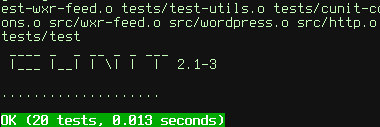

Colorful output handler for CUnit
=================================

This is a custom minimal output handler for `CUnit` framework that mimics
output of the Nette Tester. For every test, it shows a dot if test has
passed or a red letter `F` on failure. After all tests have been run, it
prints a minimal statistics.

Support notice
--------------
Framework `CUnit` does seem to be no longer developed so it makes absolutely
no sense to make any imrovements on this package. You can use it if you want
but do not expect any support whatsoever.

Licensing notice
----------------
This software is released under the [GPLv2 License](LICENSE.md).
